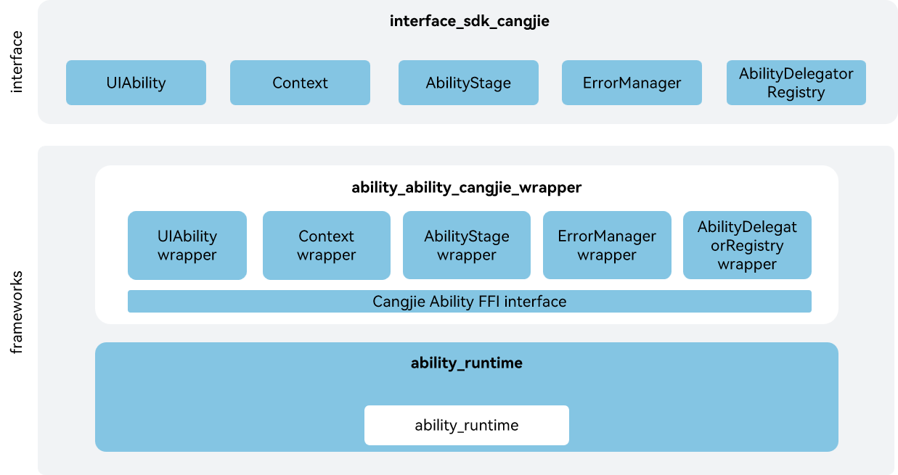

# ability_cangjie_wrapper

## Overview

The ability_cangjie_wrapper is a Cangjie API encapsulated on OpenHarmony based on the capabilities of the Ability subsystem. The **ability framework** (also called the ability management framework) is used to centrally schedule and manage the running and lifecycle of abilities. An application process can support multiple abilities, and an ability can be called either within a process or across processes. The Ability Manager Service provided in the framework schedules and manages abilities in an application and manages the lifecycle changes of these abilities. The currently open Ability Cangjie api only supports standard devices.

## System Architecture

**Figure 1** System architecture of ability_cangjie_wrapper



As shown in the architecture:

interface: Provides APIs for developers.

- UIAbility: UIAbility is an application component that has the UI. It provides lifecycle callbacks such as component creation, destruction, and foreground/background switching. Users can inherit this class to implement monitoring capabilities for UIAbility components.
- Context: The Context provides the capabilities to obtain component information. The UIAbilityContext provides the capabilities to launch or destroy other UIAbility. Users can obtain relevant information or launch other UIAbility through UIAbilityContext.
- AbilityStage: AbilityStage is a component container at the module level. When the HAP or HSP of an application is loaded for the first time, an AbilityStage instance is created. You can use the instance to perform initialization operations such as resource preloading and thread creation at the module level.
- ErrorManager: The ErrorManager Module provides the capabilities to register and unregister error observers. When users need to register or unregister an error observer, they can use the interfaces provided by this module.
- AbilityDelegatorRegistry: Users can monitor lifecycle state changes of a specified Ability and obtain test parameters through the AbilityDelegatorRegistry Module.

frameworks:

- UIAbility wrapper: Implementation encapsulation of Cangjie UIAbility, providing a UIAbility class that users can inherit.
- Context wrapper: Cangjie application context encapsulation, providing different context capabilities through Context and its subclasses.
- AbilityStage wrapper: Cangjie component manager encapsulation, encapsulating the AbilityStage class to provide component management capabilities.
- ErrorManager wrapper: Cangjie error observation management encapsulation, encapsulating the ErrorObserver class to provide error observation management capabilities.
- AbilityDelegatorRegistry wrapper: Cangjie automated test framework management encapsulation, encapsulating the AbilityDelegator and TestRunner classes to provide automated test framework management capabilities.
- Cangjie Ability FFI interface: Based on cross-language interoperability via C interfaces to implement ability Cangjie API.
- ability_runtime: It is responsible for providing basic functions of ability, and encapsulates C interfaces to provide interoperability for Cangjie.
- access_token: Provides authorization modules for querying whether permissions have been granted. Depends on its authorization module.
- cangjie_ark_interop: Responsible for providing APILevel definitions, used for annotating APIs. Also provides the BusinessException exception class definition that is thrown to users.
- arkui_cangjie_wrapper: Responsible for providing Cangjie UI component interfaces and basic types. The Context depends on the definition and parsing of basic types from this module.
- hiviewdfx_cangjie_wrapper: Responsible for providing HiLog APIs, used for printing logs at critical paths.
- global_cangjie_wrapper: Provides the capability to access application resources. Users can obtain the ResourceManager instance through the Context instance.
- bundlemanager_cangjie_wrapper: Provides definitions for obtaining application package information. Users can obtain ApplicationInfo and HapModuleInfo through the Context.
- communication_cangjie_wrapper: Provides the capability to use media resources. The application context depends on PixelMap from this module to set task icons.
- multimedia_cangjie_wrapper: Provides the capability to use media resources. The Context depends on PixelMap from this module.
- window_cangjie_wrapper:  Provides window instance management capabilities. UIAbility depends on WindowStage from this module to load UI components.
- accesscontrol_cangjie_wrapper: Provides application permission verification, request, and management capabilities. The AbilityKit defined in ability_cangjie_wrapper includes this module.
- testfwk_cangjie_wrapper: Provides unit testing framework and UI testing framework. The automated testing framework management encapsulation depends on the UI testing framework from this module.

## Directory Structure

```
foundation/ability/ability_cangjie_wrapper                
├── figures                                 # architecture pictures
├── kit                                     # Cangjie AbilityKit kit code
│   └── AbilityKit
├── ohos                                    # Cangjie Ability code 
│   ├── ability                             # Cangjie Ability dependency type definitions
│   ├── app
│   │   └── ability
│   │       ├── ability_delegator_registry  # Cangjie AbilityDelegatorRegistry wrapper
│   │       ├── ability_stage               # Cangjie AbilityStage wrapper
│   │       ├── error_manager               # Cangjie ErrorManager wrapper
│   │       └── ui_ability                  # Cangjie UIAbility and Context wrapper
│   └── application
│       └── test_runner                     # Cangjie TestRunner wrapper
└── test                                    # Cangjie test code
    ├── ability_delegator               # Cangjie AbilityDelegator test code
    ├── ability_delegator_registry      # Cangjie AbilityDelegator test code
    ├── ability_stage                   # Cangjie AbilityStage test code  
    ├── app_recovery                    # Cangjie app recovery test code  
    ├── base_context                    # Cangjie Context test code
    ├── error_manager                   # Cangjie ErrorManager test code
    └── ui_ability_context              # Cangjie UIAbilityContext test code
```


## Usage Guidelines

The following features are provided:

  - UIAbility is an application component that has the UI. It provides lifecycle callbacks such as component creation, destruction, and foreground/background switching.
  - The Context provides the capabilities to obtain component information. The UIAbilityContext provides the capabilities to launch or destroy other UIAbility.
  - AbilityStage is a component container at the module level. You can use the instance to perform initialization operations such as resource preloading and thread creation at the module level.
  - The ErrorManager Module provides the capabilities to register and unregister error observers.
  - AbilityDelegatorRegistry Module can be used to monitor lifecycle state changes of a specified Ability and obtain test parameters through.
  - Test cases can be run through the TestRunner Module.

For Ability-related APIs, please refer to [ohos.app.ability (Ability)](https://gitcode.com/openharmony-sig/arkcompiler_cangjie_ark_interop/tree/master/doc/API_Reference/source_en/apis/AbilityKit). For relevant guidance, please refer to [Ability Kit Guide](https://gitcode.com/openharmony-sig/arkcompiler_cangjie_ark_interop/blob/master/doc/Dev_Guide/source_en/application-models/cj-abilitykit-overview.md).

## Code Contribution

Developers are welcome to contribute code, documentation, etc. For specific contribution processes and methods, please refer to [Code Contribution](https://gitcode.com/openharmony/docs/blob/master/en/contribute/code-contribution.md).

## Constraints

The following features are not provided yet:

 - ExtensionAbility which for scenario-specific ExtensionAbilities.
 - InsightIntent Module.
 - AppStartup Module.

## Repositories Involved

[ability_ability_runtime](https://gitcode.com/openharmony/ability_ability_runtime)

[security_access_token](https://gitcode.com/openharmony/security_access_token)

[arkcompiler_cangjie_ark_interop](https://gitcode.com/openharmony-sig/arkcompiler_cangjie_ark_interop)

[arkui_arkui_cangjie_wrapper](https://gitcode.com/openharmony-sig/arkui_arkui_cangjie_wrapper)

[hiviewdfx_hiviewdfx_cangjie_wrapper](https://gitcode.com/openharmony-sig/hiviewdfx_hiviewdfx_cangjie_wrapper)

[accesscontrol_accesscontrol_cangjie_wrapper](https://gitcode.com/openharmony-sig/accesscontrol_accesscontrol_cangjie_wrapper)

[global_global_cangjie_wrapper](https://gitcode.com/openharmony-sig/global_global_cangjie_wrapper)

[bundlemanager_bundlemanager_cangjie_wrapper](https://gitcode.com/openharmony-sig/bundlemanager_bundlemanager_cangjie_wrapper)

[communication_communication_cangjie_wrapper](https://gitcode.com/openharmony-sig/communication_communication_cangjie_wrapper)

[multimedia_multimedia_cangjie_wrapper](https://gitcode.com/openharmony-sig/multimedia_multimedia_cangjie_wrapper)

[window_window_cangjie_wrapper](https://gitcode.com/openharmony-sig/window_window_cangjie_wrapper)

[testfwk_testfwk_cangjie_wrapper](https://gitcode.com/openharmony-sig/testfwk_testfwk_cangjie_wrapper)
