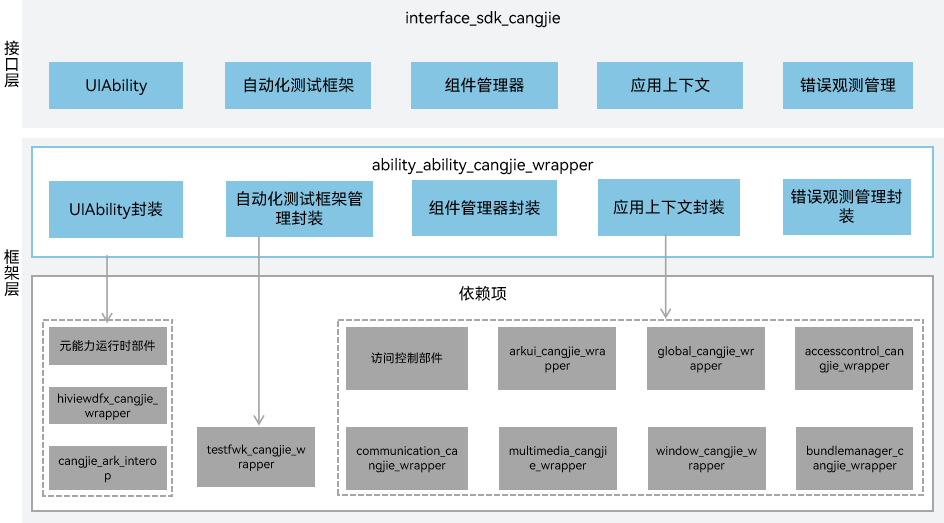

# 元能力仓颉接口

## 简介

元能力仓颉接口是在OpenHarmony上基于元能力子系统能力之上封装的仓颉API。元能力子系统实现对Ability的运行及生命周期进行统一的调度和管理，应用进程能够支撑多个Ability，Ability具有跨应用进程间和同一进程内调用的能力。Ability管理服务统一调度和管理应用中各Ability，并对Ability的生命周期变更进行管理。当前开放的元能力仓颉接口仅支持standard设备。

## 系统架构

**图 1** 元能力仓颉架构图



如架构图所示：

- UIAbility：UIAbility是包含UI界面的应用组件，提供UIAbility组件创建、销毁、前后台切换等生命周期回调的能力。开发者可通过继承此类来实现对UIAbility组件的监控能力。应用上下文提供了获取组件信息的能力。
- 应用上下文：应用上下文提供了Ability或Application的上下文的基础能力，包括访问特定应用程序的资源等。UIAbility组件的上下文提供了拉起其他UIAbility、销毁UIAbility的能力。开发者可通过UIAbilityContext获取相关信息或拉起其他UIAbility。
- 组件管理器：一个Module级别的组件管理器，用于进行Module级别的资源预加载、线程创建等初始化操作，以及维护Module下的应用状态。
- 错误观测管理：提供了对错误观察器的注册和注销能力。当开发者需要注册或注销错误观察器时，可以使用其提供的接口。
- 自动化测试框架管理：开发者可通过此模块来监视指定的Ability的生命周期状态更改和获取测试参数。
- 仓颉元能力FFI接口定义：负责定义C互操作仓颉接口，用于实现仓颉元能力的能力。
- 元能力基础框架模块：负责提供元能力基础功能，封装C接口提供给仓颉进行互操作。

## 目录

```
foundation/ability/ability_cangjie_wrapper                
├── figures                   # 存放README中的架构图
├── kit                       # 仓颉AbilityKit的kit化代码
│   └── AbilityKit
└── ohos                      # 仓颉元能力接口实现   
    ├── BUILD.gn
    ├── ability
    ├── app
    └── application
```


## 使用说明

元能力仓颉接口提供了以下功能，开发者可以根据使用诉求，综合使用一类或多类接口：

  - UIAbility是包含UI界面的应用组件，提供UIAbility组件创建、销毁、前后台切换等生命周期回调的能力。
  - 应用上下文提供了获取组件信息、拉起其他UIAbility、销毁UIAbility的能力。
  - 组件管理器用于进行Module级别的资源预加载、线程创建等初始化操作。
  - 错误观测管理模块提供了对错误观察器的注册和注销能力。
  - 自动化测试框架使用指南模块可用于监视指定的Ability的生命周期状态更改和获取测试参数。
  - 框架测试模块可用于运行测试用例。


与ArkTS相比，暂不支持以下功能：

  - 支持特定场景拓展能力的ExtensionAbility。
  - 对接端侧意图框架的意图执行基类。
  - 启动任务的相关能力。


元能力相关API请参见[ohos.app.ability (Ability)](https://gitcode.com/openharmony-sig/arkcompiler_cangjie_ark_interop/blob/master/doc/API_Reference/source_zh_cn/apis/AbilityKit/cj-apis-ability.md)，相关指导请参见[程序框架服务开发指南](https://gitcode.com/openharmony-sig/arkcompiler_cangjie_ark_interop/tree/master/doc/Dev_Guide/source_zh_cn/application-models)。

## 参与贡献

欢迎广大开发者代码，文档等，具体的贡献流程和方式请参见[参与贡献](https://gitcode.com/openharmony/docs/blob/master/zh-cn/contribute/%E5%8F%82%E4%B8%8E%E8%B4%A1%E7%8C%AE.md)。

## 相关仓

[ability_ability_runtime](https://gitee.com/openharmony/ability_ability_runtime)

[security_access_token](https://gitee.com/openharmony/security_access_token)

[arkcompiler_cangjie_ark_interop](https://gitcode.com/openharmony-sig/arkcompiler_cangjie_ark_interop)

[global_global_cangjie_wrapper](https://gitcode.com/openharmony-sig/global_global_cangjie_wrapper)

[arkui_arkui_cangjie_wrapper](https://gitcode.com/openharmony-sig/arkui_arkui_cangjie_wrapper)

[hiviewdfx_hiviewdfx_cangjie_wrapper](https://gitcode.com/openharmony-sig/hiviewdfx_hiviewdfx_cangjie_wrapper)

[bundlemanager_bundlemanager_cangjie_wrapper](https://gitcode.com/openharmony-sig/bundlemanager_bundlemanager_cangjie_wrapper)

[communication_communication_cangjie_wrapper](https://gitcode.com/openharmony-sig/communication_communication_cangjie_wrapper)

[multimedia_multimedia_cangjie_wrapper](https://gitcode.com/openharmony-sig/multimedia_multimedia_cangjie_wrapper)

[window_window_cangjie_wrapper](https://gitcode.com/openharmony-sig/window_window_cangjie_wrapper)
